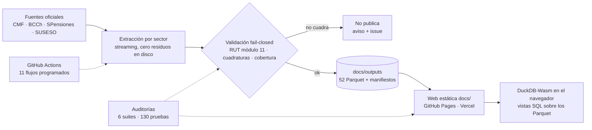

# Sistema de Información Financiera de Chile (SIF)

**Plataforma de datos y web analítica del sistema financiero chileno.** Extrae, valida y publica información de **15 sectores supervisados** (CMF, Banco Central, SPensiones y SUSESO) como **52 tablas Parquet** con **8,9 millones de filas**, y las deja consultables con **SQL en el navegador** mediante DuckDB-Wasm. Sin backend, sin base de datos, sin servidores: el dato viaja como Parquet estático y el motor corre en el cliente.


| En números | |
|---|---|
| Sectores supervisados cubiertos | **15** |
| Tablas publicadas | **52** Parquet · 8.942.793 filas · 261,8 MB |
| Serie temporal | **2001-01 → 2026-08** |
| Fuentes oficiales | CMF · BCCh · SPensiones · SUSESO |
| Web | 7 pestañas · 52 opciones del visor · 6 paletas |
| Automatización | **11 flujos** programados en GitHub Actions |
| Calidad | **6 suites de auditoría** + **130 pruebas** unitarias |

---

## 1. Qué resuelve

Los datos del mercado financiero chileno existen, son públicos y son difíciles de usar: están repartidos entre cuatro instituciones, en formatos distintos (TXT delimitados, XLSX, ZIP con XML/XBRL, PDF escaneados, HTML sin API), con identificadores inconsistentes y sin garantía de continuidad. Este proyecto los convierte en un producto consultable:

- **Extracción** en *streaming* desde cada fuente, sin acumular residuos en disco.
- **Normalización**: RUT con dígito verificador módulo 11, períodos `AAAA-MM`, montos en CLP/USD, nombres de entidad homologados.
- **Validación fail-closed**: cuadraturas contables (activos = pasivos + patrimonio), cobertura mínima por período y verificación de esquema. Si un dato no cuadra, **no se publica** y el flujo avisa.
- **Publicación** como Parquet particionado con manifiestos incrementales, servido como sitio estático.
- **Exploración** con SQL real en el navegador, diccionario de datos y mapa relacional.

### Cómo verlo funcionando

```bash
git clone https://github.com/joaquinignaciomondaca-code/monitor-financiero-chile && cd monitor-financiero-chile
python3 -m scripts.preview_no_cache --port 8000     # sirve docs/ sin caché, con soporte HTTP Range
# → http://localhost:8000
```

El servidor local soporta `206 Partial Content` igual que GitHub Pages, así que DuckDB-Wasm lee sólo el pie y los grupos de fila que necesita en vez de bajar archivos completos. Para publicarlo: el repositorio incluye un flujo de **GitHub Pages** (`pages.yml`, despliega `docs/` tal cual) y también funciona en **Vercel** como sitio estático sin build.

---

## 2. Arquitectura



El mismo Parquet que se publica es el que se consulta: no hay copia intermedia, ni ETL nocturno, ni servicio que se caiga. Eso hace al sitio **barato, reproducible y auditable**: cualquiera puede descargar el archivo y recalcular el resultado.

### Stack

| Capa | Tecnología |
|---|---|
| Extracción | Python 3.11 · `requests` + `BeautifulSoup` (HTML), `openpyxl` (XLSX), `PyMuPDF`/`pdfplumber` (PDF), `Playwright` (sitios sin API), `bcchapi` (BCCh) |
| Datos | `pandas` + `pyarrow` → Parquet particionado con manifiestos JSON (períodos, archivos, registros y hash de origen) |
| Automatización | GitHub Actions: 11 flujos programados con commit controlado, issue automático si una fuente se atrasa |
| Frontend | JavaScript sin framework **y sin build** · DuckDB-Wasm 1.28.0 embebido · CSS con variables (6 paletas) |
| Calidad | `unittest` (130 pruebas) + 6 suites de auditoría propias en Python y Node |

---

## 3. La web (`docs/`)

Aplicación estática de **siete pestañas** (cada una a pantalla completa, sin panel inferior):

| Pestaña | Qué hace |
|---|---|
| **Información** | Portada del sistema: cobertura, fuentes y estado de cada sector. |
| **Mapa relacional** | Diagrama entidad-relación en canvas, con zoom, paneo y enlaces entre tablas. |
| **Diccionario** | Campo por campo: rol (PK, FK, dimensión, métrica), definición y criterio contable. |
| **Visor de datos** | Consulta tabular con filtro, orden y copia de celdas. |
| **Consultas SQL** | Terminal con autocompletado, historial, favoritos y enlaces compartibles. |
| **Descargas** | Catálogo de los 52 conjuntos: filas, período, peso y archivos, con Parquet, CSV y Excel. |
| **Normativa CMF** | Seguimiento de la normativa publicada por la CMF. |

- **Explorador jerárquico**: 12 industrias → 15 sectores → 38 carpetas temáticas → 52 tablas, con consultas sugeridas por carpeta.
- **Motor embebido**: copia local de DuckDB-Wasm 1.28.0 (`docs/vendor/duckdb/`) con respaldo por CDN, de modo que las consultas funcionan aunque la red del visitante bloquee el CDN.
- **Vocabulario único** (`docs/vocabulario.json`): una tabla se llama `<sector>.<tipo>` y **toda lista de entidades se llama `lista_entidades`**, sin sinónimos. `scripts/normalizar_vocabulario.py` propaga ese vocabulario a la interfaz y falla si algo se sale de la convención. Los nombres históricos sobreviven únicamente como vistas de alias en SQL, nunca en pantalla.
- **Atajos**: `Alt`+`1`…`7` para las pestañas, `/` para el buscador. La última pestaña usada se recuerda.

---

## 4. Datos y cobertura

| Sector | Carpeta | Tablas | Filas | Serie | Fuente |
|---|---|---:|---:|---|---|
| Seguros de Vida y Generales | `seguros/` | 9 | 4.103.093 | 2016-11 → 2026-08 | CMF · Circular 1835 |
| Fondos Mutuos | `ffmm/` | 5 | 3.306.744 | 2001-01 → 2026-08 | CMF · Circular 1333 |
| Fondos de Inversión | `fi/` | 8 | 1.036.645 | 2020-03 → 2026-06 | CMF · LUF / Circular 1998 |
| Corredoras de Bolsa | `corredoras_bolsa/` | 4 | 185.921 | 2010-12 → 2026-06 | CMF · FECU IFRS |
| Administradoras Generales de Fondos | `agf/` | 3 | 129.711 | 2010-06 → 2026-06 | CMF · IFRS |
| Macroeconomía y Tasas | `macro/` | 5 | 80.375 | diaria → mensual | BCCh |
| Factoring y Leasing | `factoring_leasing/` | 3 | 52.446 | 2009-03 → 2026-06 | CMF · IFRS |
| Sociedades Securitizadoras | `securitizadoras/` | 3 | 25.985 | 2009-12 → 2026-06 | CMF · IFRS |
| Cajas de Compensación | `ccaf/` | 3 | 13.555 | 2010-06 → 2026-06 | CMF · TXT IFRS (XBRL) |
| Patrimonios Separados | `securitizadoras/` | 2 | 7.981 | dic. 2014 → 2025 | CMF · PDF de estados financieros |
| Banca | `bancos/` | 3 | 41 · 1,93 M † | 2022-01 → 2026-07 | CMF · B1/B2/R1 |
| FinTech | `fintech/` | 1 | 263 | registro vigente | CMF · Ley 21.521 (RPSF) |
| Sistemas de Pago | `sistemas_pago/` | 1 | 19 | registro vigente | BCCh / CMF |
| Fondos de Pensiones | `pensiones/` | 1 | 7 | registro vigente | SPensiones · D.L. 3.500 |
| Cooperativas de Ahorro y Crédito | `cooperativas/` | 1 | 7 | registro vigente | CMF |
| **Total** | | **52** | **8.942.793** | **2001 → 2026** | |

† En banca, *balance* y *resultados* son vistas filtradas sobre las mismas 55 particiones mensuales (1,93 M filas fuente). La pestaña Descargas no muestra un total engañoso para ellas: informa que las filas se cuentan al consultar.

Cada tabla publica además su **manifiesto** (períodos, archivos, registros y hash de origen), lo que permite verificar que lo que muestra la web es exactamente lo que se descargó de la fuente.

---

## 5. Automatización (GitHub Actions)

Los flujos corren solos, publican con commit controlado y dejan rastro auditable:

| Flujo | Frecuencia | Publica |
|---|---|---|
| `macro.yml` | diario | Macro BCCh: tasas, divisas, precios y catálogo de series |
| `bancos_cmf_mensual.yml` | días 1, 11, 21 | Particiones B1/B2/R1 de la CMF (incremental, valida antes de publicar) |
| `ifrs_sectores.yml` | días 2, 12, 22 | Estados IFRS de AGF, securitizadoras y CCAF |
| `factoring_leasing_backfill.yml` | días 3, 13, 23 | Serie IFRS de balance y resultados |
| `corredoras_eeff.yml` | días 6, 16, 26 | FECU IFRS de corredores y agentes de valores |
| `seguros_carteras.yml` | días 7, 17, 27 | Cartera de inversiones Circular 1835 |
| `ffmm_carteras.yml` | días 8, 18, 28 | Cartera de fondos mutuos Circular 1333 |
| `fi_carteras.yml` | días 9, 19, 29 | Cartera y pactos de fondos de inversión |
| `entidades.yml` | días 10, 20, 28 | Altas y vigencia de las listas de entidades |
| `normativa_cmf.yml` | lunes a viernes | Normativa publicada por la CMF |
| `web_audit.yml` | lunes y en cada push | Auditorías del sitio + guardián de frescura de los datos |
| `pages.yml` | push a `main` | Despliegue del sitio estático |

Un **guardián de automatización** (`scripts/audit_automatizacion.py`) cruza el manifiesto de datos, el inventario de flujos y las vistas del sitio: cada tabla publicada tiene un responsable declarado, y si un flujo deja de entregar datos en el plazo esperado, abre un issue.

---

## 6. Calidad y verificación

Todo lo que promete este README se puede comprobar con un comando:

```bash
python scripts/audit_web_full.py            # Parquet, enlaces, chips SQL, diccionario y ERD
python scripts/audit_interfaz.py            # pestañas, catálogo, vocabulario, temas, motor
node   scripts/audit_interfaz_dom.js        # 39 comprobaciones de comportamiento en un DOM (requiere jsdom)
python scripts/audit_navigation.py          # taxonomía: 12 familias, 52 tablas, 52 opciones del visor
python scripts/audit_automatizacion.py      # quién actualiza cada tabla y con qué frecuencia
node   scripts/audit_normativa_web.js       # sección de normativa CMF
python scripts/normalizar_vocabulario.py --check   # el vocabulario de nombres no se desincroniza
python scripts/build_download_catalog.py --check   # el catálogo de descargas refleja lo publicado
```

Los flujos maduros (bancos, factoring-leasing, macro, normativa) corren además sus **130 pruebas unitarias** en CI antes de publicar. Las suites de auditoría no son decorativas: son el contrato del proyecto — si la web y los datos se separan, el push falla.

---

## 7. Decisiones de diseño

1. **Sin backend.** Parquet estático + HTTP Range + DuckDB-Wasm: cero infraestructura, cero costo de servidor y ninguna copia de los datos fuera de la fuente. El mismo archivo que se descarga es el que se consulta.
2. **Fail-closed antes que "algo es mejor que nada".** Un balance que no cuadra, un archivo con más de 1 % de filas ilegibles o un mes con cobertura bajo el 90 % detienen la publicación. La web muestra "no disponible" antes que un número inventado.
3. **Un vocabulario, no convenciones orales.** Todo nombre visible vive en `docs/vocabulario.json` y un verificador recorre el repositorio; los sinónimos desaparecieron de la interfaz por construcción, no por disciplina.
4. **Compatibilidad sin contaminar.** Los nombres históricos de las vistas siguen funcionando en SQL (alias), pero no se sugieren en pantalla: quien tiene una consulta guardada no se rompe, y quien llega nuevo ve un solo criterio.
5. **Auditorías como contrato ejecutable.** Cada promesa del README se traduce en un chequeo automático; la documentación no puede quedar desactualizada en silencio.

---

## 8. Mapa del repositorio

```
<fuente>/            extracción por sector (seguros, ffmm, fi, bancos, macro, ccaf, agf, …)
  scripts/           extractores, normalizadores y auditorías del sector
  tests/             pruebas unitarias del flujo
pipelines/           flujos transversales
  entidades/         altas y vigencia de las listas de entidades (CMF y SPensiones)
  ifrs_sectores/     estados IFRS trimestrales (AGF, securitizadoras, CCAF)
  normativa_cmf/     seguimiento de normativa
  auto/inventario.json  quién actualiza cada tabla y con qué frecuencia
  manual/            ingesta de notas y reportes transcritos
docs/                sitio estático (lo que se publica)
  index.html         la aplicación (7 pestañas)
  js/  css/          interfaz, motor DuckDB, catálogo de descargas
  vocabulario.json   nombres canónicos de todas las tablas
  outputs/           52 Parquet publicados + manifiestos
  vendor/duckdb/     DuckDB-Wasm embebido (MIT)
  notas/             bitácora técnica de las decisiones
scripts/             auditorías, generadores y servidor de vista previa
.github/workflows/   11 flujos programados + despliegue
PSEUDOCODIGO.md      mapa de código: qué hace cada pieza y en qué orden
```

**Documentación**: [`PSEUDOCODIGO.md`](PSEUDOCODIGO.md) (mapa de código y decisiones) · [`pipelines/README.md`](pipelines/README.md) (operación de datos) · [`docs/notas/rediseno_ui_2026-09-28.md`](docs/notas/rediseno_ui_2026-09-28.md) (bitácora del rediseño) · READMEs por sector (`bancos/`, `ccaf/`, `factoring_leasing/`, `fi/`, `macro/`, `pensiones/`).

---

## 9. Deuda técnica conocida

Publicar los pendientes es parte del trabajo:

1. **Credenciales**: las claves de la API del Banco Central deben vivir sólo en GitHub Secrets y hay que rotar las que alguna vez estuvieron en el repositorio.
2. **Utilidades duplicadas**: el dígito verificador, el parseo de números chilenos y el tipo de cambio están copiados en ~15 scripts; su lugar es un módulo `common/`.
3. **Higiene del repositorio**: conviven scripts exploratorios con pipelines productivos, y el historial pesa ~270 MB por Parquet antiguos (candidato a Git LFS o releases).
4. **Cobertura de pruebas despareja**: los 130 tests se concentran en los flujos maduros; los sectores "stream + audit" se validan con auditorías, no con pruebas unitarias.
5. **Publicación**: definir si el proyecto se publica con GitHub Pages, en Vercel, o se mantiene privado con demo bajo solicitud.

---

## 10. Autor

**Joaquín Mondaca** — [LinkedIn](https://www.linkedin.com/in/joaqu%C3%ADnmondaca/) · [GitHub](https://github.com/joaquinignaciomondaca-code)

Proyecto de datos de punta a punta: extracción, validación estadística y contable, publicación incremental, automatización y producto web.

---

## Licencia

© 2026 Joaquín Mondaca. Código publicado con fines de portafolio y evaluación técnica. Los datos pertenecen a sus fuentes oficiales (CMF, Banco Central de Chile, SPensiones, SUSESO) y se publican tal como ellas los emiten.
