# Circular 1835 (CMF Seguros) — Arquitectura Integral de Carteras de Inversión

## 1. Marco Normativo y Alcance
La **Circular N° 1.835** de la Comisión para el Mercado Financiero (**CMF**, ex SVS) establece el régimen de información periódica obligatoria sobre las carteras de inversión de todas las compañías de **Seguros Generales** y **Seguros de Vida** en Chile.

Cada mes calendario, las aseguradoras remiten archivos planos de ancho fijo estructurados por clases de activos. Esta base de datos representa el universo más exhaustivo de activos institucionales de Chile, cubriendo más de 15 años de historia (2007–2026), billones de pesos en activos administrados y millones de contratos e instrumentos individuales.

---

## 2. Mapa de Clases de Activos (Sub-bases de Datos)

| Prefijo Archivo | Nombre Base de Datos | Clase de Activo / Instrumento | Métricas Clave | Custodio Principal |
| :--- | :--- | :--- | :--- | :--- |
| **`p*.txt`** | **Derivados y Liquidez (B.7)** | Forwards (FWC/FWV), Swaps (S), Repos/Pactos (PCCV), Opciones (CALL/PUT) | Nocional, Precios Spot/Forward, MTM M$ CLP, Tasa Pacto | Bancos locales / Extranjeros |
| **`a*.txt`** | **Acciones Nacionales (A)** | Renta Variable Local (IPSA, IGPA, Cuotas Fondos Inversión Transados) | Cantidad de acciones, Presencia bursátil %, Precio cierre CLP, Valor mercado M$ CLP | DCV |
| **`f*.txt`** | **Fondos Nacionales (F)** | Fondos Mutuos (CFM) y Fondos de Inversión no transados (CFI) | Cantidad cuotas, Valor cuota, Costo adquisición, Valor mercado M$ CLP | DCV / Administradoras AGF |
| **`x*.txt`** | **Activos Extranjeros (X)** | Vehículos Globales, ETFs (S&P 500, MSCI), Private Equity, Deuda Internacional | Divisa origen (USD/EUR), Valor moneda origen, Valor mercado M$ CLP | Custodios Globales / DCV |
| **`i*.txt`** | **Deuda e Inversiones en Bonos (I)** | Bonos Corporativos, Bonos Bancarios, Bonos de Tesorería (BTU, BTP) | Tasa emisión (cupón), TIR compra %, TIR mercado %, Valor mercado M$ CLP | DCV |
| **`b*.txt`** | **Bienes Raíces e Inmuebles (B)** | Propiedades, oficinas, locales comerciales, terrenos, bodegas | Rol avalúo fiscal SII, Comuna, Avalúo fiscal, Tasación comercial, Valor libro | Empresas Tasadoras periciales |
| **`c*.txt`** | **Carátula y Solvencia (C)** | Balance consolidado de inversiones, control de calce y patrimonio | Total inversión M$ CLP, Patrimonio comprometido | CMF / Aseguradora |
| **`d*.txt`** | **Deudores por Premias / Créditos (D)** | Cartera de mutuos hipotecarios y préstamos con garantía | Saldo insoluto, Garantías, Provisiones | Compañía |
| **`e*.txt`** | **Efectivo y Depósitos (E)** | Caja, depósitos a plazo bancarios, cuentas a la vista | Monto colocado, Plazo, Banco colocador | Bancos |

---

## 3. Diagrama Entidad-Relación (Modelo Relacional)

Todas las clases de activos se integran bajo una clave relacional común compuesta por `rut_aseguradora` y `periodo` (YYYY-MM), permitiendo cruzar exposiciones, duraciones, riesgos de contraparte y solvencia:

```mermaid
erDiagram
    ASEGURADORA ||--o{ CARATULA_BALANCE : reporta
    ASEGURADORA ||--o{ ACCIONES_LOCALES : custodia
    ASEGURADORA ||--o{ FONDOS_NACIONALES : suscribe
    ASEGURADORA ||--o{ ACTIVOS_EXTRANJEROS : invierte
    ASEGURADORA ||--o{ DEUDA_BONOS : posee
    ASEGURADORA ||--o{ DERIVADOS_B7 : pacta
    ASEGURADORA ||--o{ BIENES_RAICES : es_propietaria

    ASEGURADORA {
        string rut_aseguradora PK "RUT Aseguradora (ej: 070015730-K)"
        string nombre_aseguradora "Razón Social CMF"
        string sector "VIDA o GENERALES"
    }

    CARATULA_BALANCE {
        string periodo PK "Año-Mes (ej: 2024-06)"
        string rut_aseguradora PK,FK
        string rubro "Rubro contable de inversión"
        float total_inversion_m_clp "Total cartera M$ CLP"
        float patrimonio_comprometido "Exigencia solvencia"
    }

    ACCIONES_LOCALES {
        string periodo PK
        string rut_aseguradora PK,FK
        string nemotecnico PK "Símbolo bursátil (CHILE, BCI, SQM-B)"
        string serie "Serie acción"
        float cantidad_acciones "Acciones en cartera"
        float precio_cierre_clp "Precio cierre Bolsa Santiago"
        float presencia_pct "Presencia bursátil % (0-100)"
        float valor_mercado_m_clp "Valor en M$ CLP"
        string custodio "DCV"
    }

    FONDOS_NACIONALES {
        string periodo PK
        string rut_aseguradora PK,FK
        string run_fondo PK "RUN Fondo CMF"
        string tipo_fondo "CFM / CFI"
        string nemotecnico "Código y Serie del Fondo"
        float cuotas_cartera "Cuotas suscritas"
        float valor_cuota "Valor liquidación cuota"
        float valor_mercado_m_clp "Valoración M$ CLP"
        string clasificacion_riesgo "Categoría CMF"
    }

    DEUDA_BONOS {
        string periodo PK
        string rut_aseguradora PK,FK
        string nemotecnico PK "Código bono (BTU, BTP, Corporativo)"
        date fecha_compra "Fecha inversión"
        date fecha_vencimiento "Maturity"
        float tasa_emision_pct "Tasa cupón / carátula"
        float tir_compra_pct "TIR adquisición"
        float tir_mercado_pct "TIR cierre mensual"
        float valor_mercado_m_clp "M$ CLP"
    }

    DERIVADOS_B7 {
        string periodo PK
        string rut_aseguradora PK,FK
        string tipo_derivado PK "FWD / SWAP / REPO / OPC"
        string contraparte "Banco contraparte"
        float nocional_usd "Nocional pactado"
        float mtm_m_clp "Mark-to-Market M$ CLP"
    }

    BIENES_RAICES {
        string periodo PK
        string rut_aseguradora PK,FK
        string rol_avaluo PK "Rol SII propiedad"
        string comuna "Comuna ubicación"
        date fecha_tasacion "Último peritaje"
        float avaluo_fiscal_m_clp "Avalúo SII"
        float tasacion_comercial_m_clp "Tasación pericial"
        float valor_libro_m_clp "Valor balance"
    }

    ACTIVOS_EXTRANJEROS {
        string periodo PK
        string rut_aseguradora PK,FK
        string gestora_fondo "Administradora global"
        string nemotecnico "Ticker / Vehículo offshore"
        string moneda "USD / EUR"
        float valor_moneda_origen "Monto divisa origen"
        float valor_mercado_m_clp "Equivalente M$ CLP"
    }
```



---

## 4. Diccionario de Datos y Especificaciones de Parsing

### 4.1. `A` — Acciones Nacionales (Renta Variable)
* **Archivo fuente**: `a*.txt` (ancho fijo ~470 caracteres).
* **Fórmula de Consistencia**: `Precio de Cierre (CLP) = (Valor Mercado M$ CLP * 1,000) / Cantidad de Acciones`.
* **Calibración Verificada**:
  * `nemotecnico`: `line[31:91].strip()`
  * `serie`: `line[91:101].strip()`
  * `cantidad_acciones`: `float(line[101:115]) / 10.0` (14 caracteres, expresado originalmente en miles de acciones con 4 decimales).
  * `presencia_pct`: `float(line[115:123]) / 100.0` (porcentaje 0.00% a 100.00%).
  * `valor_mercado_m_clp`: Extraído en los 13 caracteres inmediatamente precedentes al identificador de moneda `$$` (`line[curr_pos-13:curr_pos]`).
  * **Resultados de Auditoría (Muestra 2024-06)**:
    * `CHILE`: 105.63 CLP | Presencia: 90.9% | Total M$: $9,768,985 M$.
    * `BCI`: 26,431.73 CLP | Presencia: 83.3% | Total M$: $23,146,627 M$.
    * `BSANTANDER`: 44.39 CLP | Presencia: 75.0% | Total M$: $5,612,162 M$.
    * `SQM-B`: 38,589.48 CLP | Presencia: 84.6% | Total M$: $32,025,314 M$.
    * `CMPC`: 1,783.47 CLP | Presencia: 100.0% | Total M$: $22,197,215 M$.

### 4.2. `F` — Fondos Nacionales (Mutuos y de Inversión)
* **Archivo fuente**: `f*.txt` (ancho fijo ~338 caracteres).
* **Fórmula de Consistencia**: `Valor Mercado (M$ CLP) = (Cuotas Cartera * Valor Cuota) / 1,000`.
* **Calibración Verificada**:
  * `rut_administradora`: `line[1:11].strip()` (ej: Banchile AGF, BICE AGF, Santander AGF).
  * `run_fondo`: `line[11:21].strip()` (código público de fondo mutuo).
  * `tipo_fondo`: `line[21:31].strip()` (`CFM` para Fondo Mutuo, `CFI` para Fondo de Inversión).
  * `nemotecnico`: `line[31:curr_pos-17].strip()`
  * `cuotas_cartera`: `float(line[curr_pos-17:curr_pos]) / 100,000.0` (17 dígitos con 5 decimales).
  * `valor_cuota`: `float(post[4:21]) / 10,000.0` (17 dígitos con 4 decimales).

### 4.3. `I` — Cartera de Deuda y Bonos
* **Archivo fuente**: `i*.txt` (ancho fijo 930 caracteres exactos).
* **Calibración Verificada**:
  * `tipo_bono`: `line[43:53].strip()` (`BE` bono corporativo, `BB` bono bancario, `BT` bono tesorería).
  * `nemotecnico`: `line[53:83].strip()` (ej: `BTU0150326`, `BANDI-B2`, `BESVA-H`).
  * `tasa_emision_pct`: Extraída del bloque `M` de condiciones de emisión (`/ 10,000.0`, ej: 4.64%).
  * `tir_compra_pct`: `float(line[774:782]) / 10,000.0` (TIR anual de adquisición pactada).
  * `tir_mercado_pct`: `float(line[818:826]) / 10,000.0` (TIR de mercado al cierre de mes).
  * `valor_mercado_m_clp`: `float(line[854:866])` (M$ CLP).
  * `custodio`: `line[866:869].strip()` (`DCV`).

### 4.4. `B` — Bienes Raíces e Inmuebles
* **Archivo fuente**: `b*.txt` (ancho fijo 477 caracteres exactos).
* **Calibración Verificada**:
  * `rol_avaluo`: `line[1:15].strip()` (Rol de avalúo SII).
  * `direccion`: `line[145:185].strip()`.
  * `codigo_comuna`: `line[185:188].strip()`.
  * `comuna`: `line[188:218].strip()` (ej: `SANTIAGO`, `VINA DEL MAR`, `VALPARAISO`).
  * `fecha_tasacion`: `line[218:226]` (`YYYYMMDD`).
  * `avaluo_fiscal_m_clp`: `float(line[227:239]) / 1,000.0` (SII).
  * `costo_adquisicion_m_clp`: `float(line[239:253]) / 1,000.0`.
  * `tasacion_comercial_m_clp`: `float(line[253:266]) / 1,000.0`.
  * `valor_libro_m_clp`: `float(line[266:278]) / 1,000.0`.

### 4.5. `P` — Derivados Financieros (Anexo B.7)
* **Archivo fuente**: `p*.txt` (ancho fijo histórico 489 caracteres o 587 caracteres moderno).
* **Consolidados**: Forwards (`b7_forwards.parquet`), Swaps (`b7_swaps.parquet`), Repos (`b7_repos.parquet`), Opciones (`b7_opciones.parquet`).

---

## 5. Arquitectura de Visualización y Consulta Web (GitHub Pages + DuckDB-Wasm)

Para materializar la visión de un visualizador analítico interactivo sin incurrir en costos de servidor ni bases de datos tradicionales:

```
+-------------------------------------------------------------------------------+
|                      PORTAL ANALÍTICO DE SEGUROS (GITHUB PAGES)                |
+-------------------------------------------------------------------------------+
|                                                                               |
|  [ PANEL SUPERIOR: DIAGRAMA RELACIONAL INTERACTIVO ]                         |
|  - Diagrama ERD SVG interactivo con tablas vinculadas (A, F, X, I, B, P, C).  |
|  - Al hacer clic en una tabla o campo, se pre-carga la consulta SQL asociada. |
|                                                                               |
+-------------------------------------------------------------------------------+
|                                                                               |
|  [ PANEL INFERIOR: CONSOLA TIPO POWERSHELL / TERMINAL SQL ]                  |
|  - Motor: DuckDB-Wasm ejecutándose 100% en el navegador (WebAssembly).        |
|  - Consultas directas sobre archivos Parquet vía HTTP Range Requests.         |
|  - Prompt interactivo:                                                        |
|      PS seguros:\> SELECT nemotecnico, AVG(tir_mercado_pct) FROM 'bonos.parquet' |
|      GROUP BY nemotecnico ORDER BY 2 DESC LIMIT 5;                            |
|                                                                               |
|  [ RESULTADOS ]                                                               |
|  - Grilla interactiva con exportación instantánea a CSV y JSON.               |
+-------------------------------------------------------------------------------+
```

### Factibilidad Técnica en GitHub Pages:
1. **GitHub Pages permite 1 sitio por repositorio**:
   * Podemos crear una carpeta `docs/` o `web/` en este mismo repositorio y publicarlo directamente en GitHub Pages (ej: `https://<usuario>.github.io/<repo>/`).
2. **DuckDB en el Navegador (DuckDB-Wasm)**:
   * No requiere backend ni servidor Python activo. DuckDB compila a WebAssembly y corre en la CPU y memoria RAM del usuario que visita la página.
   * Lee directamente los archivos `.parquet` alojados en el repositorio de GitHub mediante peticiones de rango HTTP (`Range: bytes=...`), descargando únicamente las columnas y bloques consultados.
3. **Cero Costo de Infraestructura**:
   * Alojamiento gratuito en GitHub Pages, escalable a cualquier cantidad de usuarios.

---

## 6. Procedimiento de Ejecución y Auditoría

### A. Ejecutar Auditoría de Calibración sobre 1 ZIP:
```bash
python seguros/circular_1835_cartera/scripts/test_calibrate_all.py
```

### B. Ingesta Masiva de Derivados (Completada):
```bash
# Todos los períodos 2007-2026 procesados y consolidados en outputs/
python seguros/circular_1835_cartera/scripts/reprocess_history.py
```
